<!-- ============================ HERO ============================ -->
<div align="center">
  
</div>

<!-- ============================ TYPING TAGLINE ============================ -->
<div align="center">
  <a href="https://github.com/AmrendraTheCoder">
    
  </a>
</div>

<br/>

<!-- ============================ BADGES ============================ -->
<div align="center">

  
  <a href="https://github.com/AmrendraTheCoder?tab=followers">
    
  </a>
  

</div>

<br/>

<!-- ============================ ABOUT ============================ -->
## About Me

```typescript
const amrendra = {
  name: "Amrendra Vikram Singh",
  handle: "@AmrendraTheCoder",
  location: "Uttar Pradesh, India",
  mindset: "Focusing on what I can create and trusting my own abilities.",

  languages: ["TypeScript", "JavaScript", "Python", "Go", "Solidity"],
  building: {
    web: ["Next.js", "React", "Node.js", "Tailwind CSS"],
    ai: ["RAG pipelines", "LLM applications", "AI agents"],
    backend: ["PostgreSQL", "Supabase", "REST & realtime APIs"],
    web3: ["Solidity smart contracts", "RWA platforms"],
  },

  currentFocus: "Platforms for students, campuses and small businesses",
};
```

<br/>

<!-- ============================ TECH STACK ============================ -->
## Tech Stack

<div align="center">

**Languages**


**Frameworks & Libraries**


**Databases & Cloud**


**Tools**


</div>

<br/>

<!-- ============================ FEATURED PROJECTS ============================ -->
## Featured Projects

<table>
  <tr>
    <td width="50%">
      <h3 align="center">FinanceGhost</h3>
      <p align="center">
        <a href="https://github.com/AmrendraTheCoder/financeghost">
          
        </a>
      </p>
      <p align="center">AI-powered financial advisor with invoice management, cashflow forecasting and tax optimization.</p>
    </td>
    <td width="50%">
      <h3 align="center">TengibleFi</h3>
      <p align="center">
        <a href="https://github.com/AmrendraTheCoder/TengibleFi">
          
        </a>
      </p>
      <p align="center">Real-world asset tokenization platform built with Go and Solidity. <a href="https://rwa-main-delta.vercel.app">Live demo</a></p>
    </td>
  </tr>
  <tr>
    <td width="50%">
      <h3 align="center">Jodein</h3>
      <p align="center">
        <a href="https://github.com/AmrendraTheCoder/jodein">
          
        </a>
      </p>
      <p align="center">Multi-tenant WhatsApp bot for Indian colleges with AI, RAG, attendance alerts and student onboarding.</p>
    </td>
    <td width="50%">
      <h3 align="center">MediBOX</h3>
      <p align="center">
        <a href="https://github.com/AmrendraTheCoder/justfortheETH">
          
        </a>
      </p>
      <p align="center">Blockchain-based medical platform for secure health records and prescriptions.</p>
    </td>
  </tr>
  <tr>
    <td width="50%">
      <h3 align="center">Event Management</h3>
      <p align="center">
        <a href="https://github.com/AmrendraTheCoder/eventManagement">
          
        </a>
      </p>
      <p align="center">Full-stack event management platform in TypeScript. <a href="https://event-management-five-eta.vercel.app">Live demo</a></p>
    </td>
    <td width="50%">
      <h3 align="center">LNMHacks Website</h3>
      <p align="center">
        <a href="https://github.com/AmrendraTheCoder/lnmhacks-demo-website">
          
        </a>
      </p>
      <p align="center">Hackathon website built in TypeScript. <a href="https://lnmhacks-demo-website.vercel.app">Live demo</a></p>
    </td>
  </tr>
</table>

<br/>

<!-- ============================ GITHUB ANALYTICS ============================ -->
## GitHub Analytics

<div align="center">
  
  
</div>

<div align="center">
  
</div>

<br/>

<div align="center">
  
</div>

<br/>

<!-- ============================ CONTRIBUTION SNAKE ============================ -->
<div align="center">
  <picture>
    <source media="(prefers-color-scheme: dark)" srcset="https://raw.githubusercontent.com/AmrendraTheCoder/AmrendraTheCoder/output/github-snake-dark.svg"/>
    <source media="(prefers-color-scheme: light)" srcset="https://raw.githubusercontent.com/AmrendraTheCoder/AmrendraTheCoder/output/github-snake.svg"/>
    
  </picture>
</div>

<br/>

<!-- ============================ CONNECT ============================ -->
## Connect

<div align="center">

  <a href="https://github.com/AmrendraTheCoder">
    
  </a>
  <a href="mailto:dev.mockr@gmail.com">
    
  </a>
  <a href="https://www.linkedin.com/in/amrendravikramsingh">
    
  </a>

</div>

<br/>

<!-- ============================ FOOTER ============================ -->
<div align="center">
  
</div>
